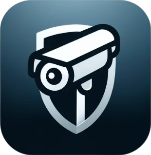

# Guardian-Eye

## Overview
Guardian-Eye is an innovative surveillance system currently under development, aimed at providing a comprehensive monitoring solution for various locations. This system is equipped to recognize individuals and is capable of sending a recorded clip to the user when it detects an unknown person. Additionally, Guardian-Eye offers a live feed feature, enabling users to watch real-time footage from their cameras. This combination of individual recognition, alerts, and live surveillance ensures a high level of security and convenience. Currently in its initial stages, the Guardian-Eye project is focused on delivering robust features for effective security management.

## Features (In Development)
- Multiple Camera Support: Users can connect multiple cameras scattered across different locations.
- Motion Detection & Alerts: Cameras are equipped to detect unknown individuals and immediately send notifications to the user.
- Recorded Clips: Upon detection of an unknown person, the system records a 30-second clip for user review.
- Live Feed: A live feed feature allows users to view real-time footage from their cameras.
  
## Technology Stack
- Python for backend processing
- React for the frontend interface
- Node.js for server-side operations

## Contributing
You are welcome to contribute to the Guardian-Eye project.

## License
This project is licensed under the [MIT License](./LICENSE) - see the LICENSE file for details.
